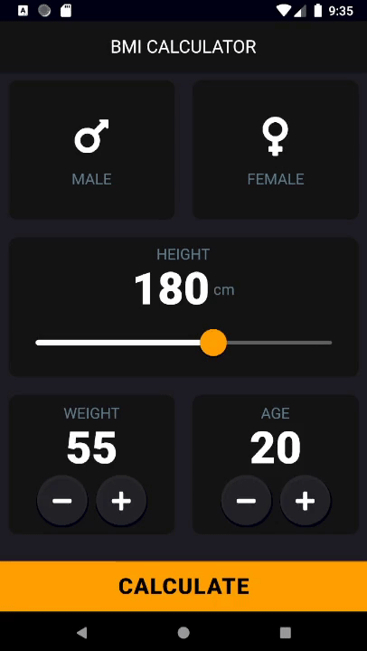

# bmi_calculator in Flutter

Flutter is an open-source UI software development kit created by Google.

## What is BMI? BMI stands for 'Body Mass Index'; it is used to determine whether you are in a healthy weight range for your height.
It is calculated as your weight (kg) divided by the square of your height (m).

This app is a companion project to [The App Brewery's Complete Flutter Development Bootcamp] (https://www.appbrewery.co/)

## How To Use

1. Open up the app 'BMI CALCULATOR'.
2. Select your Gender, Height, Weight, and Age.
3. Press 'Calculate' - it is only an estimate and it doesn’t take into account other factors such as ethnicity and waist measurement.
   • Underweight (<18.5) 
   • Normal (18.5 - 24.9)
   • Overweight (>25.0)

## Flutter Installation Guide

To edit the project, you need to set up Flutter for Android Studio.

If you have a PC, you will need to:

1. Install the Flutter SDK

2. Install Android Studio

3. Install the Android Emulator

[Windows Setup Guide] (https://flutter.dev/docs/get-started/install/windows)

Or if you have a Mac, you need to:

1. Install the Flutter SDK

2. Install Android Studio

3. Install the Android Emulator

4. Install Xcode and command-line tools

[MacOS Setup Guide] (https://flutter.dev/docs/get-started/install/macos)
