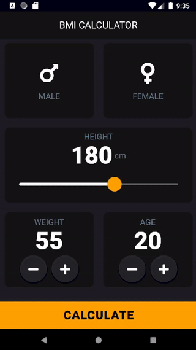
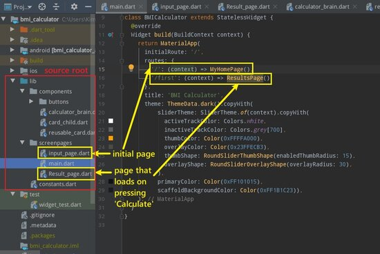

# BMI Calculator

A simple BMI calculator app created using [Flutter](https://flutter.dev/) & [Android Studio](https://developer.android.com/studio).
This app was created with the help of [The App Brewery's Complete Flutter Development Bootcamp by Dr. Angela Yu](https://www.appbrewery.co/)



## What is BMI?

Body Mass Index, or **BMI** is used to determine whether you are in a healthy weight range for your height.
It is calculated using the formula:
```
_bmi = weight / pow(height / 100, 2);
```
Basically, it's your **weight** (kg) divided by the square of your **height** (m).

## How To Use The App

1. Open up the app 'BMI CALCULATOR'.
2. Select your Gender, Height, Weight, and Age.
3. Press 'Calculate'
- Underweight (<18.5) 
- Normal (18.5 - 24.9)
- Overweight (>25.0)
- (Note: This is only an estimate and it doesn’t take into account other factors such as ethnicity and waist measurement.)

## Flutter Installation Guide

To edit the project, you need to set up **Flutter SDK** for Android Studio.


If you have a PC, you will need to:

1. Install the Flutter SDK

2. Install Android Studio

3. Install the Android Emulator

[Windows Setup Guide](https://flutter.dev/docs/get-started/install/windows)

Or if you have a Mac, you need to:

1. Install the Flutter SDK

2. Install Android Studio

3. Install the Android Emulator

4. Install Xcode and command-line tools

[MacOS Setup Guide](https://flutter.dev/docs/get-started/install/macos)
